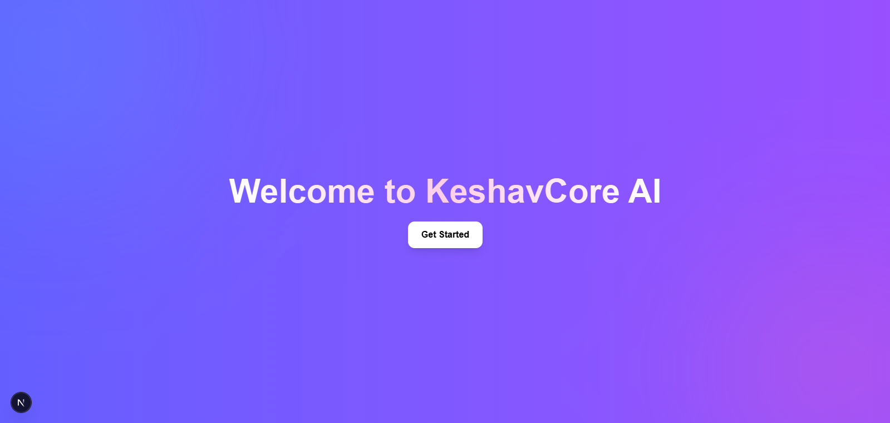
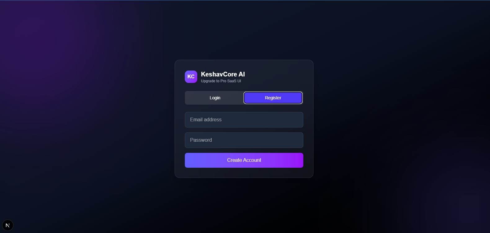
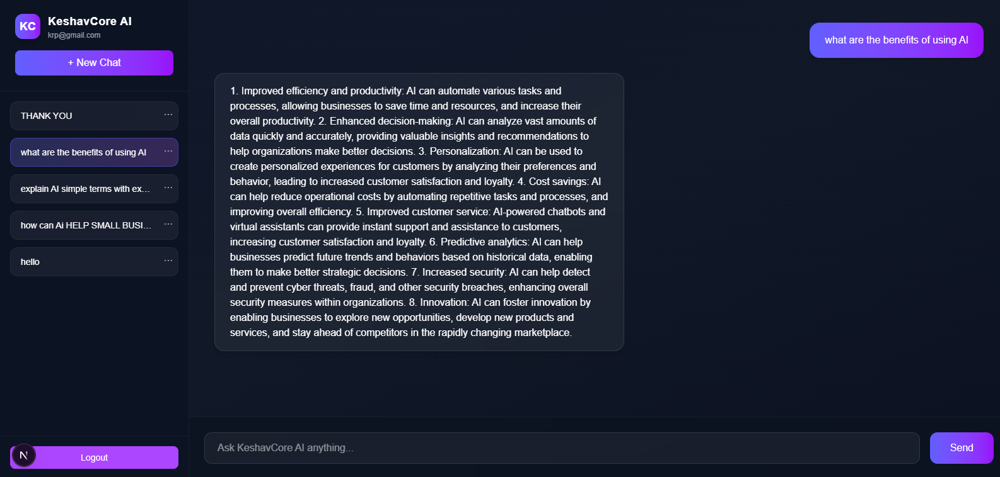
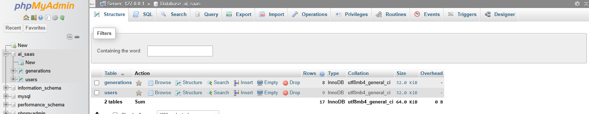

# 🚀 KeshavCore AI

KeshavCore AI is a full-stack AI SaaS web application where users can interact with an AI assistant and store conversation history.

---

## ✨ Features

* Animated AI landing page
* User authentication (Login & Register)
* AI chat dashboard
* Conversation history sidebar
* Prompt & response stored in database

---

## 🛠 Tech Stack

### Frontend

* Next.js
* Tailwind CSS

### Backend

* PHP

### Database

* MySQL

### Tools

* XAMPP
* phpMyAdmin

---

## 📌 Workflow

Landing Page → Login/Register → AI Dashboard → Stored Conversations

---

## ⚙️ Installation

### Frontend

```bash
npm install
npm run dev
```

### Backend

Run using **XAMPP (Apache + MySQL)**.

---
## 📸 Screenshots

### Landing Page


### Login & Register


### AI Dashboard


### Database Structure


## 🎥 Demo Video

[Watch Demo](SAAS_AI_DEMO.mp4)
## 👩‍💻 Author

Payal Patel
